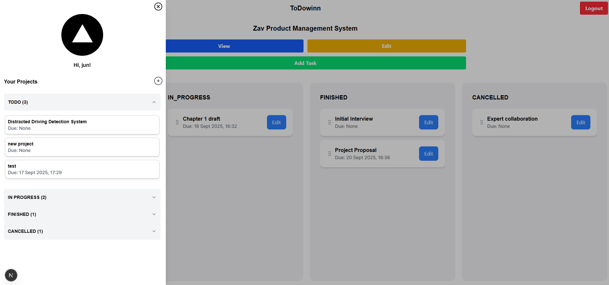

# Todowinn Project Manager

todowinn is a simple web application that allows users to manage and track projects that they are currently working on.

## 📌 Application Key Features

---

- 🎯 **Project Management**: allows users to add, edit and manage projects, recording details such as its name, description, date created and target date. Helps users to be on track in achieving goals.
- 💾 **Dedicated Database**: has its own dedicated database to allow persistent and safe storage of project and user data. You may refer to the ERD available at `./docs`
- 👤 **User Accounts**: allows users to create their own accounts to safely store and manage their own projects, **isolated from projects of other users.**
- 🔒 **JWT Authentication**: uses JsonWebTokens to verify and validate API requests, making the application more secure against attackers, while also **preventing other users from modifying resources that they do not own.** **Redirecting users** back to the login page if they do not have a valid JWT.
- 🔑 **Password Hashing**: hashes passwords using **Argon2** algorithm **to securely store and verify user passwords** on the database, without exposing the passwords themselves, making accounts much more secure.
- 🫙 **Containerized**: containerized using Docker to ensure **application consistency and predictability** in all types of environments using a `compose.yaml` file which dictates how the different parts of the application _(database, backend, frontend)_ will communicate. Allows the application to be easily ran locally and in production.

## 📚 Tech Stack

---

<div align="center">

| Category           | Technology | Version |
| :----------------- | :--------: | :-----: |
| Frontend Framework |  Next.js   | 15.5.2  |
| HTTP Client        |   Axios    | ^1.11.0 |
| CSS Framework      |  Tailwind  |   ^4    |
| Backend Framework  |   Nestjs   | ^11.0.1 |
| Database Server    |   MySQL    |   8.0   |
| ORM                | Prisma ORM |  ^6.15  |
| Containerization   |   Docker   | ^28.2.2 |

</div>

## 🏗️ System Architecture

---

<div align="center">


</div>

## 💻 Run locally for the first time

---

1. Install latest version of [Docker Desktop](https://www.docker.com/get-started/), installing the Docker Engine.
2. Create dedicated folder and clone repository using

```git
git clone https://github.com/JLaxy/todowinn.git .
```

3. Download .env files [here](https://drive.google.com/file/d/1j77gIkkzGkyDYW8LjT-ltqkt10-Vsjqv/view?usp=sharing), place and extract on root folder, on the level as compose.yaml (message me in Discord for password)
4. Ensure that no other application is using ports `3000` and `3001` to avoid issues.
5. Open terminal and navigate to your dedicated folder then run `docker compose up --build` on your terminal, on the same level where `compose.yaml` is located. Docker will automatically download all dependecies needed by the application. Wait until you see that `mysqldb-1` is running, do not close the terminal. *(it may take a while depending on internet speed.)*
6. Open a new terminal on the root folder of the project and then run `docker compose exec backend npx prisma migrate deploy` and then `docker compose exec backend npx prisma generate` to initialize database tables. You must see success messages. **This is important if running the application for the first time.**
7. Access application via [http://localhost:3000](http://localhost:3000).
8. Close application by pressing `CTRL + C` on terminal.

>You may now relaunch the application in the future by only executing `docker compose up`.

## 🧩 Current Limitations

---

At the time of submission, due to balancing development with other responsibilities, some parts are still subject for development — but the backend is fully functional and testable.

- 📒 **Task Management**: the user interface does not currently support task creation and management. However, endpoints for task creation and management **are already created on the backend and fully functioning** and can be tested using any API testing tools such as [Postman](https://www.postman.com/downloads/). _see `task.controller.ts` on `backend/src/tasks` and `tasks.http` on `backend/test`_
- 👤 **User Management**: the user interface does not currently support user management. However, endpoints for user management **are already created on the backend and fully functioning** and can be tested using any API testing tools such as [Postman](https://www.postman.com/downloads/). _see `members.controller.ts` on `backend/src/members` and `members.http` on `backend/test`_

- 🗃️ **Data Initialization Endpoint**: the application currently has no endpoint to create mock data on database.

- 📜 **Task Update Log**: the application currently has no ability to log and view all of the changes done on project tasks.

## ♻️ Request / Response Life Cycle

---

<div align="center">


</div>

## 📌 Backend Key Features

---

- 🛡️ **Authentication and Ownership Guards**: filters out requests that do not have a valid JWT or requests that are attempting to modify a resource _(project, task, member)_ that is not owned by the client requesting from reaching the controller that handles the request.
- 🔑 **HTTPOnly Cookies**: safely stores JWT on cookies to prevent malicious attacks such as XSS. _(recommended to create SSL certificate to allow HTTPS connection)_
- ❗ **Global Error Handling**: has a dedicated global error handler that handles different types of errors such as normal NestJS and Prisma-related errors.
- 🪈 **Global Pipes**: uses global pipes that automatically transform data into desired datatype. Also prevents requests that have unexpected body attributes.
- ⚪ **ORM**: utilizes Prisma ORM to be able to easily manipulate and refer to database entities as objects, elevating developer experience and promoting developers to be more productive by focusing less on creating SQL queries.

## 📌 Frontend Key Features

---

- 🛡️ **Protected Routes**: protects routes such as `/projects` and `/tasks` from being accessed by clients that do not have a valid JWT, redirecting them back to the `/login` route using middleware.
- ❗ **API Error Normalizer**: has utility to normalize API errors to avoid exposing important error information to the client browser.

## 📷 Sample UI Screenshots

---

### Login

<div align="center">


</div>

### Sign-Up

<div align="center">


</div>

### Projects

<div align="center">



</div>

---

<div align="center">
Crafted with passion and perseverance 💙
</div>
